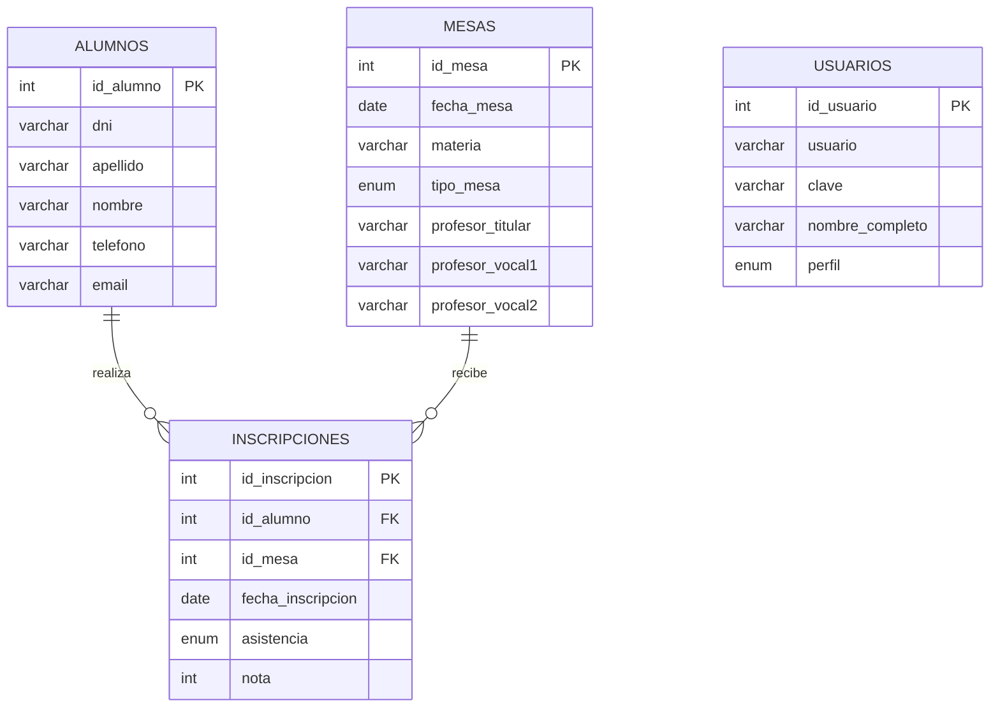

# Diagrama Entidad Relacion

Programador: Maximiliano Faria  
Fecha de desarrollo: Junio/2026  
Materia: Programacion 3 de la TSDS  
Curso: Tecnicatura Superior en Desarrollo de Software

## Entidades

- `alumnos`: guarda los datos personales de los alumnos.
- `mesas`: guarda fecha, materia, tipo de mesa y tribunal.
- `inscripciones`: relaciona alumnos con mesas de examen.
- `usuarios`: guarda datos de acceso y perfil.

## Relaciones

- Un alumno puede tener muchas inscripciones.
- Una mesa puede tener muchas inscripciones.
- Cada inscripcion pertenece a un alumno y a una mesa.
- Los usuarios se usan para el control de acceso del sistema.

